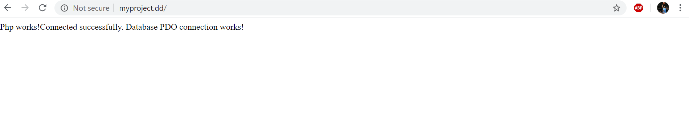
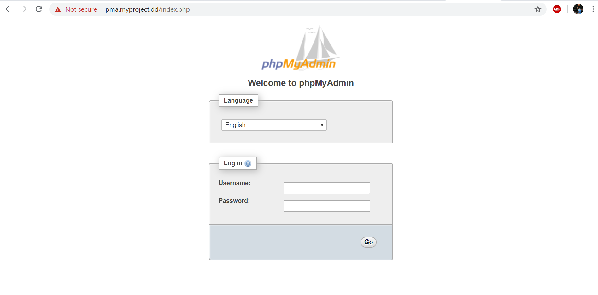

# lemp-docker
A full lemp docker stack with ubuntu, nginx, mysql, phpmyadmin and nginx as reverse proxy for domains


## 1. Create the external network (only once)
```
git clone https://github.com/georgetour/nginx-proxy.git
```

Then run in the folder you cloned
```
docker-compose up -d
```

## 2. Clone the files from here and copy all the files in the folder you want 
```
git clone git@github.com:georgetour/lemp-docker.git
```

## 3. Rename the example.env to .env in your working project folder and example.php to index.php

## 4. After having all the files to the project you will work run
```
docker-compose up -d
```

## 5. Add this line to your hosts file as administrator or sudo
127.0.0.1 myproject.dd pma.myproject.dd

Windows
```
c:\windows\system32\drivers\etc\hosts
```
Mac
```
sudo vim /etc/hosts
```
Ubuntu
```
sudo vim /etc/hosts
```

## 6. Visit your site locally in 
```
myproject.dd
```



## 7. Visit phpmyadmin locally in and add the creds you have in .env file
```
pma.myproject.dd
```


The project files and nginx root are in public_html and all files you have in your project folder
will appear in var/www/html when you enter the containers with:
```
docker exec -it myproject_app bash
```

## 8. PHP settings and nginx error logs
You can change PHP settings like memory etc. in php-settings/php.ini.tpl and if you have any errors
it will be logged in logs/nginx-error.log


You can change the env variables in the .env file you created. For example if you change myproject.dd to 
project2.dd you will have to add to your hosts file 127.0.0.1 project2.dd pma.myproject2.dd and you
will see your site accordingly in project2.dd and phpmyadmin pma.myproject2.dd.